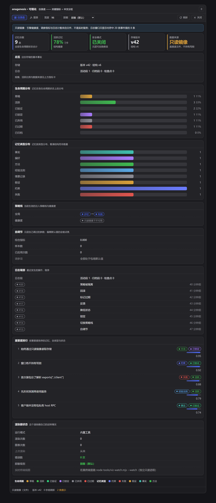
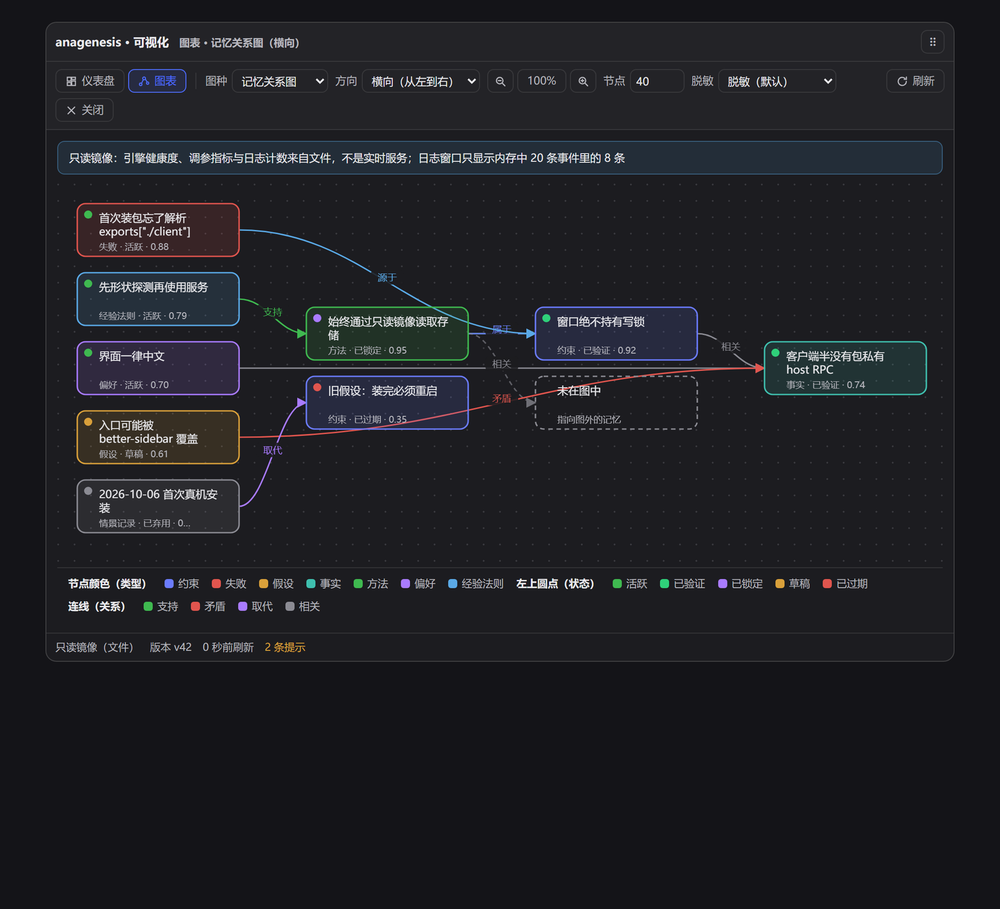
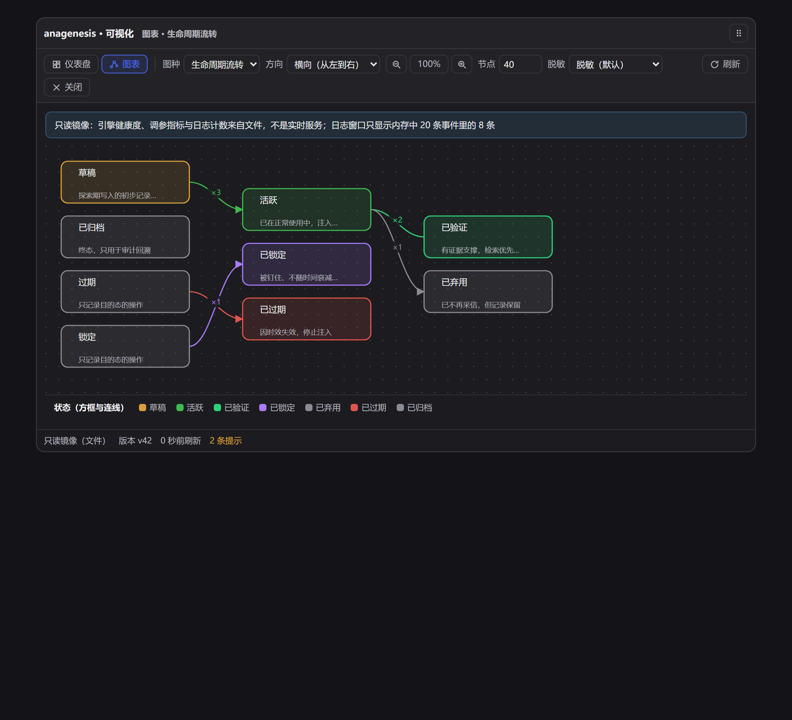
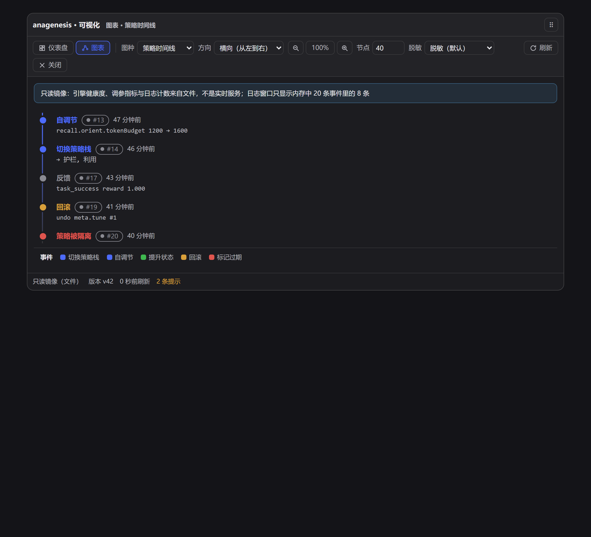

# dsh-anagenesis

[English](README.en.md) · [更新日志](CHANGELOG.md) · MIT

> **给 Agent 一套它自己管得住、你也看得见的记忆。**
>
> 不是又一个"自动记忆黑箱"：记忆操作是 Agent 手里的工具，注入策略运行时可换，
> 每次变更都带逆操作，自我调参有边界、有审计、能回滚 —— 而整个存储自包含、离线、零依赖。



## 三句话说明它是什么

- **自带闭环存储**：`journal/*.jsonl` 追加式日志 + 原子快照。不调用、不桥接、不代理任何外部记忆服务 —— 没有数据库、没有云、没有模型调用。
- **记忆是 Agent 主动调用的工具**（17 个 `ana_*`）：按**意图**召回（`orient` / `recall_precedent` / `avoid_mistake` / `reuse_procedure` / …），而不是靠后台自动抽取。
- **它不只存记忆，还管自己的行为**：注入策略可换栈、元层可自调参、护栏单调收紧、每次变更可回滚 —— 并且这三件事都留痕、可审计。

## 和典型「自动记忆」插件不一样在哪

| 维度 | 典型自动记忆插件 | anagenesis |
|---|---|---|
| 谁决定记什么 | 后台抽取，Agent 无感 | **Agent 用工具显式决定**：`ana_remember` / `ana_promote` / `ana_split` / `ana_rethink` / `ana_forget` |
| 怎么召回 | 关键词或向量相似度 | **意图驱动**：7 种意图 → 种类 / 状态 / 置信度下限 / 权重 / 粒度 / token 预算 / 多样性 |
| 注入策略 | 固定 | **运行时可换栈**（6 个具名栈），且**按作用域存栈**，一个 Agent 换栈不影响另一个 |
| 变更的后果 | 多数不可逆 | **每笔事务返回逆函数**；逆操作与正向 patch 同写日志，**重启后仍可回滚** |
| 自我调节 | 无 | **元层依据反馈自调参**：参数包络约束 + UCB1 选臂 + 审计 + 评估 + 回滚 |
| 失控风险 | — | **单调护栏 + 熔断 + `safeMode`**；能自改的只有 tier-1，外环冻结 |
| 依赖 | 常常需要外部服务或向量库 | **零运行时依赖、离线、无子进程、无网络** |
| 可见性 | 一个黑箱 | TUI 仪表盘 + mermaid/d2/ascii 文本图表 + 可选桌面窗口 |

## 安装

### 全家桶（推荐：内核 + 桌面窗口一次装齐）

```bash
dsh plugin add dsh-anagenesis          # 内核：记忆 + 策略 + 护栏 + 可视化工具
dsh plugin add dsh-anagenesis-window   # 桌面窗口（可选，但推荐一起装）
```

装完**重启 profile**。安装会自动注册名为 **`anagenesis`** 的 Agent 预设 —— 新会话里选中它即可。

> 只想要内核？第一条命令就够了。窗口**不装也完全可用**：预设知道这个能力存在，但从不假设它被安装。

### 从源码安装（想改代码、或跟进 `main`）

```bash
git clone https://github.com/3likofj/dsh-anagenesis.git
cd dsh-anagenesis
dsh plugin --profile desktop add link:<仓库绝对路径>             # 主包
dsh plugin --profile desktop add link:<仓库绝对路径>/window      # 可选：桌面窗口
```

## 五分钟上手

1. 安装并重启 profile，新建会话时选 **`anagenesis`** 预设（默认策略栈 `guard + exploit`）。
2. 正常干活就行：Agent 会自己调 `ana_recall` 与 `ana_remember` —— 你不需要写查询语言。
3. 想看一眼记忆库：让 Agent 调 `ana_dashboard`（一帧 TUI 仪表盘，直接出现在回答里）或 `ana_diagram`（可粘贴进 Markdown 的图）。
4. 想在真实终端里持续刷新：`node tools/viz-watch.mjs --watch`（只读、独立进程）。
5. 想要桌面窗口：装上第二个包并重启，然后让 Agent 调 `ana_window`，或直接点界面上的入口。

## 能力地图（17 个工具）

| 分组 | 工具 | 干什么 |
|---|---|---|
| 召回与反馈 | `ana_recall` · `ana_feedback` | 按意图取回；告诉系统刚注入的东西到底有没有用 |
| 写入与生命周期 | `ana_remember` · `ana_promote` · `ana_demote` · `ana_lock` · `ana_expire` · `ana_forget` | `draft → active → verified → locked`，或降级 / 过期 / 删除（删除只留可审计的墓碑） |
| 结构化 | `ana_link` · `ana_split` · `ana_rethink` | 建立关系；把信息过载的记忆拆窄；**反事实重思**（假设前提为假会推出什么） |
| 治理 | `ana_strategy` · `ana_tune` · `ana_audit` | 换栈 / 派生策略；元层调参与回滚；看状态、日志、审计与健康度 |
| 可视化 | `ana_dashboard` · `ana_diagram` · `ana_window` | 终端仪表盘、文本图表、桌面窗口（后两个工具各自属于可视化行与窗口行，行没装工具就不存在） |

## 注入策略：什么时候用哪副脑子

| 具名栈 | 组成 | 适合 |
|---|---|---|
| `explore` | guard + explore | 问题还在摸清阶段：高召回、低门槛，写入落为草稿 |
| `exploit` | guard + exploit | 执行已知方案：只注入已验证 / 已锁定的，写入直接生效 |
| `debug` | guard + debug | 出事那一刻：失败与未决假设优先，关闭时间衰减 |
| `distill` | guard + distill | 长会话要省 token：压缩优先，只注入要点 |
| `recon` | guard + explore + distill | 先铺开再收紧 |
| `crisis` | guard + debug + exploit | 连续失败时：失败与已验证事实同时注入 |

`guard` 是**不变量**：永远在栈底、自己不注入内容，只做"锁定信念加权 / 草稿降权 / retired 永不注入"。
策略是**纯函数包 + 有界参数**：Agent 只能"点名一个内置实现 + 参数差分"来派生新策略 —— 能持久化任意代码的 Agent，也就是能把自己弄砖的 Agent。

## 每一次变更都可以撤销

- 变更不是闭包，是**声明式 JSON patch**；存储把所有写者串行化，先追加日志、再换入冻结快照（读者因此无锁）。
- `transact()` 返回 `revert(reason)`：它把逆操作作为*补偿事件*提交，**与正向 patch 一起进日志** —— 所以重启之后回滚依然有效。
- `ana_strategy action:"revert"` 与 `ana_tune action:"rollback"` 只是这个原语上的薄封装。
- 日志有三条上界：段数超限时合并最老的归档段（**合并不丢 seq**）、检查点只留最新、以及**唯一有损**的保留策略（默认关闭；一旦丢过东西，状态视图会显式报告，而不是假装那个 seq 从没存在过）。

## 自我引导的边界（它为什么不会跑偏）

**能自我引导 —— 但外环是冻的。**

- **tier 1（可自改）**：记忆、策略栈、可调参数。Agent 能召回自己过去的失败、从内置策略派生新策略、用自己收集的反馈调整置信度下限与 token 预算。
- **tier 2（冻结）**：参数包络、可调命名空间白名单、`guard` 的存在、工具 schema、以及插件代码本身。运行中的 Agent 改不了其中任何一项。

理由很直接：能改写自己适应度函数与刹车的 Agent，会漂向"得分高"而不是"真管用"，而且没有可恢复的状态可以回滚。
这条边界是**可执行的**（8 条单调收紧的不变量 + `safeMode` 整体冻结），不是口号。

## 看得见







- **TUI 仪表盘**（`ana_dashboard`）：总览、生命周期分布、类型分布、策略栈与健康度、偏离默认值的调参旋钮、日志尾部、重要度排行、渲染器自身状态。按显示宽度精确对齐（中日韩标签不会把边框撕开），颜色只有被要求时才上。
- **文本图表**（`ana_diagram`）：Mermaid（默认）/ D2 / ASCII 三种格式；三种图 —— 记忆关系图（含 `supports` / `contradicts` / `supersedes` 等关系）、策略时间线、生命周期流转（只画日志**真实记录**到的迁移，`lock` / `expire` 这类"只记录目的态"的操作会如实说明，而不是编造一条来源边）。
- **桌面窗口**（可选兄弟包）：同一批纯函数产出的中文卡片 + 自研内联 SVG 有向图（横向 / 纵向 + 缩放），三个入口席位（better-sidebar 侧栏行 / 官方右侧边栏 / 对话顶部栏），只读镜像存储。
- 渲染是**只读投影**：一次渲染不是一次事务。唯一可选的写入 `auditRenders` 默认关闭；另一个只读进程 `tools/viz-watch.mjs` 可以在真实终端里持续刷新。

## 数据在哪、隐私如何

```
$DSH_HOME/anagenesis/
  journal/journal-000001.jsonl     追加式事件日志（每条含 seq / type / patch / undo）
  journal/archive-<seq>.jsonl      折叠后的归档（保留 undo）
  journal/checkpoint-<seq>.json    边界上的冻结状态
  snapshot.json                    原子启动缓存
```

- **全本地**：不联网、不下载模型、不调用模型、不启动子进程。
- **零运行时依赖**：检索是内置 BM25 倒排索引 + 确定性哈希向量化器（192 维），真正的语义后端可以在运行时注入。
- **脱敏默认开**：工具与窗口的输出默认 `secrets` —— 抹掉凭据形状的文本、省略正文；`strict` 连标签一起遮挡；`none` 是显式的本地调试逃生门，产物本身会就此发出警告。
- **旧目录兼容**：默认 `$DSH_HOME/anagenesis`；若检测到改名前的 `$DSH_HOME/evolution` 数据更完整，会**继续沿用旧目录并在日志里说明**，一个字节都不搬。要搬就 `npm run migrate:store`（复制 + 逐文件 sha256 校验，源目录不动）。

## 配置（全部可选，全部有安全默认值）

内核行的关键旋钮：

| 键 | 默认 | 作用 |
|---|---|---|
| `rootDir` | `$DSH_HOME/anagenesis` | 存储根目录；显式设了就完全听它的（不再回退旧目录） |
| `safeMode` | `false` | 冻结策略注册、切换与调参 |
| `recallDefaultTokenBudget` | `1600` | 召回注入的默认 token 预算 |
| `hookBudgetMs` | `8` | 单个策略钩子的时间预算（超时按失败计，不拖住召回） |
| `compactAfterEvents` | `2000` | 活跃事件超过它就压缩日志；`0` 关闭 |
| `archiveMaxSegments` | `16` | 归档段数上界（合并最老的段，不丢 seq）；`0` 不设界 |
| `retainEvents` | `0` | 唯一有损策略：只保留最近 N 条事件的归档段；`0` = 全留 |
| `embedProvider` | `hash` | 启动时用哪个向量后端；语义后端可在运行时装入 |
| `reflectionEnabled` | `true` | 定时反思：质疑证据已明显衰减的既有信念（只归档为草稿假设） |

其余：工具行 `exposeAuditTool` / `exposeTuneTool`；可视化行 `lang` / `redaction` / `width` / `auditRenders` 等；窗口包见 `window/README.md`。

## 常见问题

**会拖慢每次召回吗？** 策略钩子有 8ms 预算、超时按失败计；读取走冻结快照，不上锁。

**记忆会越写越乱吗？** 生命周期状态、置信度、重要度衰减、过期清扫、反事实重思都是显式工具，可以随时收拾。

**卸载会留残留吗？** 每一行释放自己创建的效应（工具、服务、定时器、路由、席位）；卸载后 journal 句柄关闭、存储目录可以正常删除。

**能换成真正的语义检索吗？** 能。运行时 `service.useEmbedder(...)` 装入后端，再 `reembed()` 把已存向量重算一遍；在那之前状态里会一直标记向量"陈旧"。

**为什么桌面窗口是单独的包？** 声明 `dsh.client` 的包只能有**一个**活跃 Loader 行，而内核是五行（预设还会再挂一次）。这是 DSH 的硬约束，所以窗口做成单行兄弟包。

## 开发

```bash
npm test && npm run check && npm run verify:boot   # 内核：69 个单元测试 + 语法检查 + 87 条启动沙箱检查
npm run preflight && npm run gate:pack             # 发布元数据自检 + 真打包/真装（校验安装态的导出解析）
cd window && npm run gate                          # 窗口：构建 + 83 个测试 + 真机 HTTP 探针
```

## 许可证

MIT
